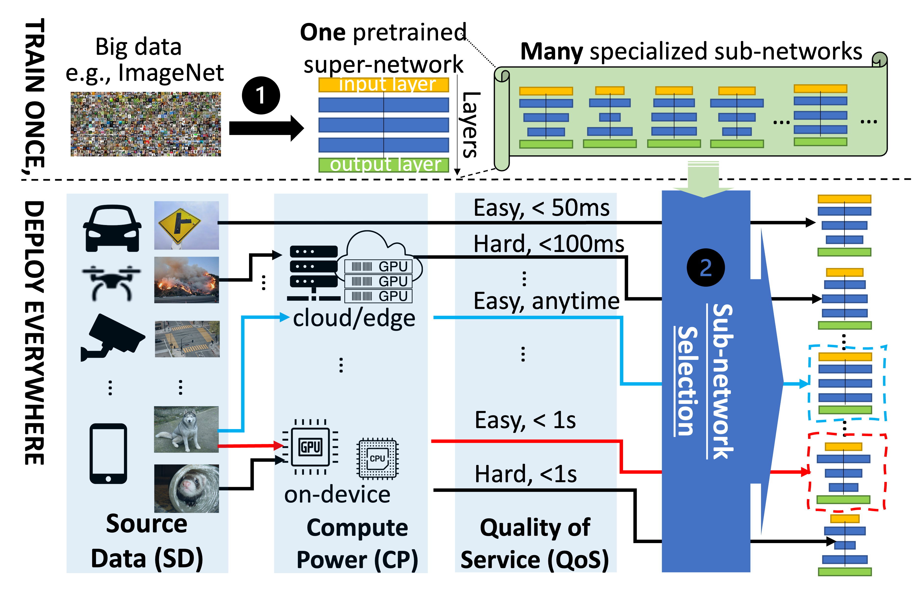

My research aims to build an efficient mobile vision system with edge-assisted live video analytics.
I am interested in exploiting and developing a multi-disciplinary solution that incorporates computer vision, edge computing multimedia and machine leanring to to enhance the system's effectiveness and efficiency. 

Currently, I am particular interested in the following problems:
* Making mobile vision more efficient with more video compression
* Enhancing DNN deployment efficiency in diverse use sceaniro

<!--Compress Video without Compromising Analytical Accuracy-->
Making mobile vision more efficient with more video compression
----
Given the fast development in computer vision, we orthogonally enforces more efficient compression for the specific vision inference tasks. It adapts to input contexts and significantly reduces the volume of video data without sacrificing visual inference accuracy (negligible
impacts).

#### DCC: Towards Live Video Analytics with On-Drone Deeper-yet-Compatible Compression

    <video width="320" height="240" controls style="float: left; margin-right: 10px;">
        <source src="../images/dcc.mp4" type="video/mp4">
        Your browser does not support the video tag.
    </video>
    
DCC utilizes the drone-specific context and intermediate information obtained from object detection to
jointly adjust the resolution, QP, and frame rate during run-time. We use vehicle detection from the drone as a showcase to show its effectiveness.

#### VPPlus: Exploring the Potentials of Video Processing for Live Video Analytics at the Edge

    <video width="320" height="240" controls style="float: left; margin-right: 10px;">
        <source src="../images/vpplus.mp4" type="video/mp4">
        Your browser does not support the video tag.
    </video>
    
VPPlus enlarges the configuration space that can be optimized during on-device processing to achieve greater compression for general object detection tasks. It generates proper feedback automatically to guide the joint tuning over more than 8 parameters (e.g. brightness, saturation, etc.).

<!--Customize DNN Deployment in Diverse Use Scenario-->
Enhancing DNN deployment efficiency in diverse use sceaniro
----
When presented with diverse mobile devices performing distinct application tasks that facilitate varying scenarios, we tailor DNN to enhance performance for each scenario with Once-For-All DNN training: Train one super network and search different sub-networks (subnet) to fit use scenario.

#### OPA:One-Predict-All For Efficient Deployment

    
    
Instead of training a specialized DNN for each deployment scenario, we have developed a
novel approach of using the shallow subnet to test the water. The effectiveness of using a
shallow subnet to accelerate the search of a deep subnet has been validated effective in image
classification, one showcase application.

